# Apple Silicon Integration Roadmap

> **Recommendation for CH:** approve Phase 1 now. Keep Phases 2–6 in a fixed
> dependency order, but authorize each only after its evidence gate is met.

This roadmap integrates the behavior proven in Omarchy MX Mac into official
Omarchy without merging the long-lived fork or transferring Apple hardware
enablement away from Asahi. The destination is one architecture-aware Omarchy
product and release channel; the route remains deliberately gated because
official ARM packages, generic ARM media, the Apple boot path, and device-level
support have different owners and different evidence requirements.

## Roadmap at a glance

```mermaid
flowchart LR
  P1["1 · Runtime boundary<br/>NOW · feasible"] -->
  P2["2 · ARM packages<br/>NEXT · gated"] -->
  P3["3 · Generic ARM media<br/>NEXT · gated"] -->
  P4["4 · Apple backend + bridge<br/>NORTH STAR · exploratory"] -->
  P5["5 · Model-gated preview<br/>NORTH STAR · conditional"] -->
  P6["6 · Channel migration<br/>NORTH STAR · conditional"]

  classDef now fill:#e8edff,stroke:#315efb,color:#17191d;
  classDef next fill:#fff3d2,stroke:#8a5a00,color:#17191d;
  classDef north fill:#f0ebff,stroke:#6847c7,color:#17191d;
  class P1 now;
  class P2,P3 next;
  class P4,P5,P6 north;
```

The phase order is fixed. The commitment is not. Every phase ends with a
go/no-go review before the next phase begins.

## Phase 1 — Establish the runtime boundary

**Readiness:** now; high confidence.

**Objective.** Make official `basecamp/omarchy` recognize Apple Silicon and
protect Asahi-owned state, without claiming that official Omarchy installs or
supports Apple hardware.

**Outputs.** A tested Apple Silicon detector; pre-mutation guards around
repository, boot, firmware, and platform-owned configuration; extracted
architecture-neutral fixes; complete optional-package availability checks; and
a documented package-input boundary for later package and media work.

**Dependencies.** A fresh branch from current upstream Quattro and a behavioral
inventory of the MX delta. No installer, package-repository, or Asahi change is
required.

**Evidence required to advance.** Positive Apple aarch64 fixtures; negative
x86-64 and generic aarch64 fixtures; proof that guarded commands make no change
before failing; focused shell tests; and an unchanged x86-64 test baseline.

**Exit gate.** The Phase 1 PR series is independently reviewable upstream,
Asahi repositories and boot state cannot be overwritten by the covered paths,
and no Apple installation or support promise has been introduced.

**Principal uncertainty.** Upstream may accept the safety boundary in smaller
or differently grouped PRs. That affects review shape, not technical
feasibility.

## Phase 2 — Official ARM package publication

**Readiness:** next; feasible after Phase 1, with known infrastructure gaps.

**Objective.** Prove and publish the complete package transaction needed by an
official aarch64 Omarchy target.

**Outputs.** One target-aware package resolution process; architecture-specific
rebuild metadata; signed aarch64 repository publication; a release bill of
materials; and validation for core and optional package closure.

**Dependencies.** The Phase 1 package-input boundary, official decisions on
repository ownership and signing, and availability from Arch Linux ARM, Asahi,
Omarchy, or approved rebuilds.

**Evidence required to advance.** A clean aarch64 transaction from configured
official repositories; reproducible package-set output with provenance; valid
repository metadata and signatures; and install/update tests in a disposable
aarch64 environment.

**Exit gate.** Official infrastructure can publish, sign, resolve, install, and
update the full aarch64 package set without relying on the MX release channel.

**Principal uncertainty.** The build tools accept aarch64, but official ARM
repository publication and the exact rebuild set do not exist today.

## Phase 3 — Produce generic ARM64 media

**Readiness:** next; feasible direction with an upstream prerequisite.

**Objective.** Make generic UEFI aarch64 a first-class `omarchy-iso` target
before adding Apple-specific installation behavior.

**Outputs.** An architecture selector for the existing media pipeline; removal
of x86-only assumptions; a generic ARM64 artifact; and CI coverage for build,
boot, package resolution, and failure of unsupported target combinations.

**Dependencies.** Phase 2 package publication and the existing
`omarchy-iso` generic aarch64 roadmap.

**Evidence required to advance.** A reproducible generic ARM64 build that boots
in its intended UEFI environment and installs the resolved official package
set. Runtime code must remain independent of media type and boot backend.

**Exit gate.** Generic ARM media is green without Apple-specific branches, and
the installer exposes a stable extension point for a later Apple platform
backend.

**Principal uncertainty.** The upstream media roadmap is defined but not yet a
proven production artifact; its final extension boundary may change during
implementation.

## Phase 4 — Add the Apple backend and Asahi bridge

**Readiness:** North Star; exploratory until Phases 2–3 are proven.

**Objective.** Join an Omarchy-owned ARM64 payload to the Apple boot environment
created and maintained according to Asahi’s distribution contract.

**Outputs.** An installer-owned Apple backend; an Omarchy-branded Asahi bridge;
safe space selection; preservation of APFS and the paired System ESP; firmware
handoff; recovery behavior; and integration with the complete Apple boot chain.

**Dependencies.** Official ARM packages, generic ARM media, Asahi policy and
installer interfaces, and explicit review of Apple boot semantics.

**Evidence required to advance.** Repeatable install, reboot, recovery, and
macOS-coexistence tests on named devices; proof that Asahi-created state is
preserved; and failure-safe behavior for unsupported layouts.

**Exit gate.** The Apple path can install and recover without overwriting macOS,
Asahi repositories, firmware, boot policy, or the paired System ESP.

**Principal uncertainty.** The Apple chain is not merely a GRUB choice. It
includes Apple boot policy, m1n1, device trees, U-Boot, the removable-media EFI
path, and GRUB, with responsibilities split across projects.

## Phase 5 — Release a model-gated preview

**Readiness:** North Star; conditional on a safe Phase 4 implementation.

**Objective.** Make a deliberately narrow official preview available only on
devices with verified installation and hardware capability evidence.

**Outputs.** A device-tree allowlist; a model/capability matrix; published known
limitations; preview installation and recovery instructions; telemetry-free
test reporting; and an explicit promotion/removal process.

**Dependencies.** The complete Phase 4 install path, current Asahi feature
support, access to representative hardware, and an agreed preview support
policy.

**Evidence required to advance.** Per-model results for installation, reboot,
display, input, storage, networking, audio, suspend, recovery, and update. A
generation label alone is not sufficient evidence.

**Exit gate.** Every allowed device has a named validation record, support
language matches actual capability, and unsupported models fail before any
destructive installation step.

**Principal uncertainty.** Asahi capability varies by SoC and device. M1/M2/M3
labels do not provide a safe support boundary by themselves.

## Phase 6 — Migrate to the standard signed channel

**Readiness:** North Star; conditional on a stable model-gated preview.

**Objective.** Move supported MX installations onto official Omarchy release
and update infrastructure, then retire separate Mac versioning and manifests.

**Outputs.** A signed migration path; package and configuration reconciliation;
rollback/recovery guidance; release-channel cutover; preservation of MX
attribution and tests; and a retirement notice for the downstream channel.

**Dependencies.** Proven official installation, update, and recovery across the
preview allowlist; stable ARM package publication; and compatible versioning
and signing policy.

**Evidence required to advance.** Successful upgrades from supported MX
versions, signature and rollback validation, package ownership reconciliation,
and a support plan for systems that are not eligible to migrate.

**Exit gate.** Supported Apple systems receive standard signed Omarchy releases
without the MX package manifests or Mac-specific version suffix, and ineligible
systems remain on a documented safe path.

**Principal uncertainty.** The migration surface depends on how much package,
installer, and release policy changes before the preview becomes stable.

## Architecture guardrails

- Keep `architecture: x86_64 | aarch64` independent from
  `platform: generic | apple-silicon`.
- Keep boot backend and artifact/media type in installer projects, not the
  shared runtime contract.
- Treat Omarchy MX Mac as evidence and test material, not a branch to merge
  wholesale.
- Preserve Asahi ownership of Apple boot policy, m1n1/U-Boot, firmware, kernel,
  device trees, and platform repositories.
- Define package resolution by required outputs—core, platform, excluded, and
  optional sets with provenance—before choosing a durable schema.
- Advance by named evidence gates, never by processor-generation labels or a
  calendar commitment alone.

## Decision requested now

Approve only Phase 1 and its upstream PR series. At the Phase 1 exit review,
use the frozen package inputs and upstream feedback to decide whether Phase 2
is justified. Phases 3–6 remain visible so Phase 1 creates the correct seams,
but they do not carry implied approval, schedule, or support promises.

## Research basis

- [Detailed Phase 1 plan](apple-silicon-phase-1-plan.md)
- [Detailed Phase 2 plan](apple-silicon-phase-2-plan.md)
- [`omarchy-iso` generic aarch64 plan](https://github.com/omacom-io/omarchy-iso/blob/quattro/plans/aarch64-support.md)
- [Asahi distribution guidelines](https://asahilinux.org/docs/alt/policy/)
- [Asahi boot process](https://asahilinux.org/docs/alt/boot-process-guide/)
- [Asahi feature support](https://asahilinux.org/docs/platform/feature-support/overview/)

Research snapshot: 2026-08-24.
